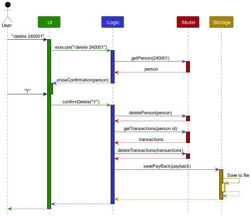
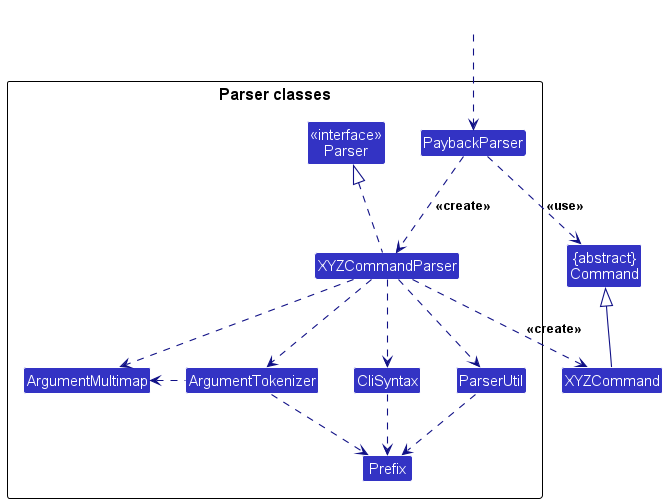
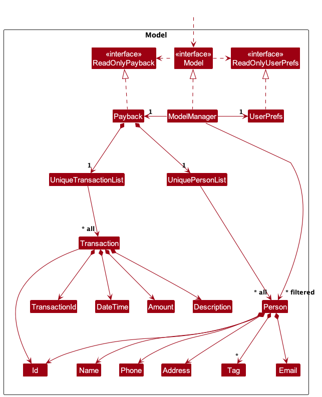
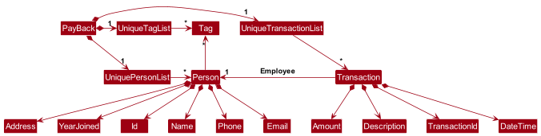
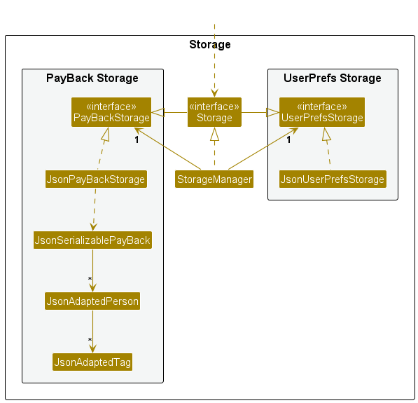
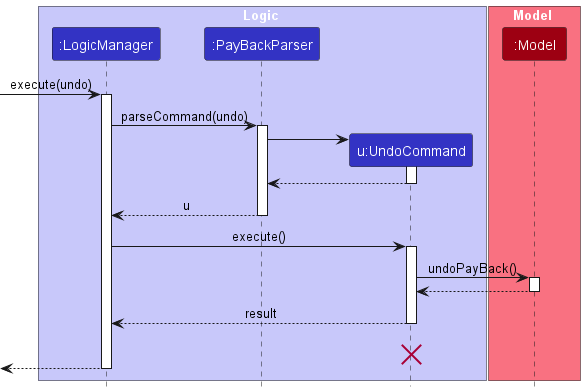
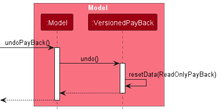
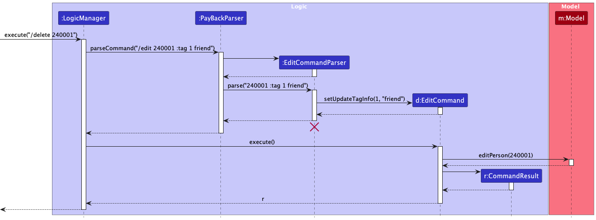
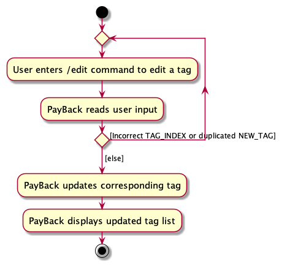

# Table of Contents
1. [Acknowledgements](#acknowledgements)
2. [Setting up, getting started](#getting-started)
3. [Design](#design)
   1. [Architecture](#architecture)
   2. [UI Component](#ui-component)
   3. [Logic Component](#logic-component)
   4. [Model Component](#model-component)
   5. [Storage Component](#storage-component)
   6. [Common Classes](#common-classes)
4. [Implementations](#implementation)
   1. [Editing a specific tag](#editing-tag)
      1. [Design considerations](#design-consideration-edit-tag)
      2. [Implementation](#implementation-edit-tag)
5. [Documentation, logging, testing, configuration, dev-ops](#documentation)
6. [Appendix: Requirements](#requirements)
   1. [Product scope](#product-scope)
   2. [User stories](#user-stories)
   3. [Use cases](#use-cases)
   4. [Non-Functional Requirements](#non-functional-requirements)
   5. [Glossary](#glossary)
7. [Appendix: Instructions for manual testing](#manual-testing)
   1. [Launch and shutdown](#launch-shutdown)
   2. [Deleting a person](#deleting)

--------------------------------------------------------------------------------------------------------------------

## **Acknowledgements** 

* GitHub Copilot auto-complete was used to improve productivity during development.
* Extra library `org.controlsfx:controlsfx:11.1.1` was used to implement Autocomplete to improve productivity during development.

--------------------------------------------------------------------------------------------------------------------

## **Setting up, getting started** 

Refer to the guide [_Setting up and getting started_](SettingUp.md).

--------------------------------------------------------------------------------------------------------------------

## **Design** 

:bulb: **Tip:** The `.puml` files used to create diagrams in this document `docs/diagrams` folder. Refer to the [_PlantUML Tutorial_ at se-edu/guides](https://se-education.org/guides/tutorials/plantUml.html) to learn how to create and edit diagrams.

### Architecture 

The ***Architecture Diagram*** given above explains the high-level design of the App.

Given below is a quick overview of main components and how they interact with each other.

**Main components of the architecture**

**`Main`** (consisting of classes [`Main`](https://github.com/AY2324S2-CS2103T-T12-4/tp/blob/master/src/main/java/seedu/address/Main.java) and [`MainApp`](https://github.com/AY2324S2-CS2103T-T12-4/tp/blob/master/src/main/java/seedu/address/MainApp.java)) is in charge of the app launch and shut down.
* At app launch, it initializes the other components in the correct sequence, and connects them up with each other.
* At shut down, it shuts down the other components and invokes cleanup methods where necessary.

The bulk of the app's work is done by the following four components:

* [**`UI`**](#ui-component): The UI of the App.
* [**`Logic`**](#logic-component): The command executor.
* [**`Model`**](#model-component): Holds the data of the App in memory.
* [**`Storage`**](#storage-component): Reads data from, and writes data to, the hard disk.

[**`Commons`**](#common-classes) represents a collection of classes used by multiple other components.

**How the architecture components interact with each other**

The *Sequence Diagram* below shows how the components interact with each other for the scenario where the user issues the command `/delete 240001`.

Each of the four main components (also shown in the diagram above),

* defines its *API* in an `interface` with the same name as the Component.
* implements its functionality using a concrete `{Component Name}Manager` class (which follows the corresponding API `interface` mentioned in the previous point.

For example, the `Logic` component defines its API in the `Logic.java` interface and implements its functionality using the `LogicManager.java` class which follows the `Logic` interface. Other components interact with a given component through its interface rather than the concrete class (reason: to prevent outside component's being coupled to the implementation of a component), as illustrated in the (partial) class diagram below.

The sections below give more details of each component.

### UI component 

The **API** of this component is specified in [`Ui.java`](https://github.com/AY2324S2-CS2103T-T12-4/tp/blob/master/src/main/java/seedu/address/ui/Ui.java)

The UI consists of a `MainWindow` that is made up of parts e.g.`CommandBox`, `ResultDisplay`, `PersonListPanel`, `StatusBarFooter` etc. All these, including the `MainWindow`, inherit from the abstract `UiPart` class which captures the commonalities between classes that represent parts of the visible GUI.

The `UI` component uses the JavaFx UI framework. The layout of these UI parts are defined in matching `.fxml` files that are in the `src/main/resources/view` folder. For example, the layout of the [`MainWindow`](https://github.com/AY2324S2-CS2103T-T12-4/tp/blob/master/src/main/java/seedu/address/ui/MainWindow.java) is specified in [`MainWindow.fxml`](https://github.com/AY2324S2-CS2103T-T12-4/tp/blob/master/src/main/resources/view/MainWindow.fxml)

The `UI` component,

* executes user commands using the `Logic` component.
* listens for changes to `Model` data so that the UI can be updated with the modified data.
* keeps a reference to the `Logic` component, because the `UI` relies on the `Logic` to execute commands.
* depends on some classes in the `Model` component, as it displays `Person` object residing in the `Model`.

### Logic component 

**API** : [`Logic.java`](https://github.com/AY2324S2-CS2103T-T12-4/tp/blob/master/src/main/java/seedu/address/logic/Logic.java)

Here's a (partial) class diagram of the `Logic` component:

The sequence diagram below illustrates the interactions within the `Logic` component, taking `execute("/delete 240001")` API call as an example.

:information_source: **Note:** The lifeline for `DeleteCommandParser` should end at the destroy marker (X) but due to a limitation of PlantUML, the lifeline continues till the end of diagram.

How the `Logic` component works:

1. When `Logic` is called upon to execute a command, it is passed to an `PayBackParser` object which in turn creates a parser that matches the command (e.g., `DeleteCommandParser`) and uses it to parse the command.
1. This results in a `Command` object (more precisely, an object of one of its subclasses e.g., `DeleteCommand`) which is executed by the `LogicManager`.
1. The command can communicate with the `Model` when it is executed (e.g. to delete a person). 
   Note that although this is shown as a single step in the diagram above (for simplicity), in the code it can take several interactions (between the command object and the `Model`) to achieve.
1. The result of the command execution is encapsulated as a `CommandResult` object which is returned back from `Logic`.

Here are the other classes in `Logic` (omitted from the class diagram above) that are used for parsing a user command:

How the parsing works:
* When called upon to parse a user command, the `PaybackParser` class creates an `XYZCommandParser` (`XYZ` is a placeholder for the specific command name e.g., `AddCommandParser`) which uses the other classes shown above to parse the user command and create a `XYZCommand` object (e.g., `AddCommand`) which the `PaybackParser` returns back as a `Command` object.
* All `XYZCommandParser` classes (e.g., `AddCommandParser`, `DeleteCommandParser`, ...) inherit from the `Parser` interface so that they can be treated similarly where possible e.g, during testing.

### Model component 
**API** : [`Model.java`](https://github.com/AY2324S2-CS2103T-T12-4/tp/blob/master/src/main/java/seedu/address/model/Model.java)

The `Model` component,

* stores the employee data i.e., all `Person` and `Transaction` objects (which are contained in `UniquePersonList` and `UniqueTransactionList` object respectively).
* stores the currently 'selected' `Person` objects (e.g., results of the /find command) as a separate _filtered_ list which is exposed to outsiders as an unmodifiable `ObservableList<Person>` that can be 'observed' e.g. the UI can be bound to this list so that the UI automatically updates when the data in the list change.
* stores the currently 'selected' `Transaction` objects (e.g., results of the /view command) as a separate _filtered_ list which is exposed to outsiders as an unmodifiable `ObservableList<Transaction>` that can be 'observed' e.g. the UI can be bound to this list so that the UI automatically updates when the data in the list change.
* stores a `UserPref` object that represents the user’s preferences. This is exposed to the outside as a `ReadOnlyUserPref` objects.
* does not depend on any of the other three components (as the `Model` represents data entities of the domain, they should make sense on their own without depending on other components)

:information_source: **Note:** An alternative (arguably, a more OOP) model is given below. It has a `Tag` list in the `Payback`, which `Person` references. This allows `Payback` to only require one `Tag` object per unique tag, instead of each `Person` needing their own `Tag` objects. 

### Storage component 

**API** : [`Storage.java`](https://github.com/AY2324S2-CS2103T-T12-4/tp/blob/master/src/main/java/seedu/address/storage/Storage.java)

The `Storage` component,
* can save both employee data and user preference data in JSON format, and read them back into corresponding objects.
* inherits from both `PayBackStorage` and `UserPrefStorage`, which means it can be treated as either one (if only the functionality of only one is needed).
* depends on some classes in the `Model` component (because the `Storage` component's job is to save/retrieve objects that belong to the `Model`)

### Common classes 

Classes used by multiple components are in the `seedu.address.commons` package.

--------------------------------------------------------------------------------------------------------------------

## **Implementation** 

This section describes some noteworthy details on how certain features are implemented.

### \[Proposed\] Undo/redo feature

#### Proposed Implementation

The proposed undo/redo mechanism is facilitated by `VersionedPayBack`. It extends `PayBack` with an undo/redo history, stored internally as an `payBackStateList` and `currentStatePointer`. Additionally, it implements the following operations:

* `VersionedPayBack#commit()` — Saves the current employee state in its history.
* `VersionedPayBack#undo()` — Restores the previous employee state from its history.
* `VersionedPayBack#redo()` — Restores a previously undone employee state from its history.

These operations are exposed in the `Model` interface as `Model#commitPayBack()`, `Model#undoPayBack()` and `Model#redoPayBack()` respectively.

Given below is an example usage scenario and how the undo/redo mechanism behaves at each step.

Step 1. The user launches the application for the first time. The `VersionedPayBack` will be initialized with the initial employee state, and the `currentStatePointer` pointing to that single employee state.

Step 2. The user executes `delete 5` command to delete the 5th person in the employee. The `delete` command calls `Model#commitPayBack()`, causing the modified state of the employee after the `delete 5` command executes to be saved in the `payBackStateList`, and the `currentStatePointer` is shifted to the newly inserted employee state.

Step 3. The user executes `add n/David …​` to add a new person. The `add` command also calls `Model#commitPayBack()`, causing another modified employee state to be saved into the `payBackStateList`.

:information_source: **Note:** If a command fails its execution, it will not call `Model#commitPayBack()`, so the employee state will not be saved into the `PayBackStateList`.

Step 4. The user now decides that adding the person was a mistake, and decides to undo that action by executing the `undo` command. The `undo` command will call `Model#undoPayBack()`, which will shift the `currentStatePointer` once to the left, pointing it to the previous employee state, and restores the employee to that state.

:information_source: **Note:** If the `currentStatePointer` is at index 0, pointing to the initial PayBack state, then there are no previous PayBack states to restore. The `undo` command uses `Model#canUndoPayBack()` to check if this is the case. If so, it will return an error to the user rather
than attempting to perform the undo.

The following sequence diagram shows how an undo operation goes through the `Logic` component:

:information_source: **Note:** The lifeline for `UndoCommand` should end at the destroy marker (X) but due to a limitation of PlantUML, the lifeline reaches the end of diagram.

Similarly, how an undo operation goes through the `Model` component is shown below:

The `redo` command does the opposite — it calls `Model#redoPayBack()`, which shifts the `currentStatePointer` once to the right, pointing to the previously undone state, and restores the employee to that state.

:information_source: **Note:** If the `currentStatePointer` is at index `payBackStateList.size() - 1`, pointing to the latest employee state, then there are no undone PayBack states to restore. The `redo` command uses `Model#canRedoPayBack()` to check if this is the case. If so, it will return an error to the user rather than attempting to perform the redo.

Step 5. The user then decides to execute the command `list`. Commands that do not modify the employee, such as `list`, will usually not call `Model#commitPayBack()`, `Model#undoPayBack()` or `Model#redoPayBack()`. Thus, the `payBackStateList` remains unchanged.

Step 6. The user executes `clear`, which calls `Model#commitPayBack()`. Since the `currentStatePointer` is not pointing at the end of the `payBackStateList`, all employee states after the `currentStatePointer` will be purged. Reason: It no longer makes sense to redo the `add n/David …​` command. This is the behavior that most modern desktop applications follow.

The following activity diagram summarizes what happens when a user executes a new command:

#### Design considerations:

**Aspect: How undo & redo executes:**

* **Alternative 1 (current choice):** Saves the entire employee list.
  * Pros: Easy to implement.
  * Cons: May have performance issues in terms of memory usage.

* **Alternative 2:** Individual command knows how to undo/redo by
  itself.
  * Pros: Will use less memory (e.g. for `delete`, just save the person being deleted).
  * Cons: We must ensure that the implementation of each individual command are correct.

_{more aspects and alternatives to be added}_

### Editing a specific tag 

#### Design considerations: 

**Aspect: How `/edit ID :tag TAG_INDEX NEW_TAG` executes:**

* **Alternative 1 (current choice):** Change one specific tag at a time.
    * Pros: Most of the time people only want to change one particular tag and this implementation gives them more convenience.
    * Cons: Harder to implement and have to change original data structure of tags.

* **Alternative 2:** Remove all current tags and add new tags
    * Pros: Easy to implement.
    * Cons: Not very user-friendly as users have to key in all tags every single time.

#### Implementation 

Given below is an example usage scenario and how the `/edit ID :tag TAG_INDEX NEW_TAG` mechanism behaves at each step.

Step 1. The user launches the application for the first time.

Step 2. The user executes `/add NAME; PHONE; EMAIL; ADDRESS; YEAR_JOINED[; TAG]…` command to add a new employee.

Step 3. The user executes `/tag ID :tag NEW_TAG` command to add tags to an existing employee.

Step 4. The user executes `/edit ID :tag TAG_INDEX NEW_TAG` command to change the name of an existing tag.

The following sequence diagram shows how an edit operation edits a specific tag for user:

The following activity diagram summarizes what happens when a user executes a `/edit ID :tag TAG_INDEX NEW_TAG` command:

--------------------------------------------------------------------------------------------------------------------

## **Documentation, logging, testing, configuration, dev-ops** 

* [Documentation guide](Documentation.md)
* [Testing guide](Testing.md)
* [Logging guide](Logging.md)
* [Configuration guide](Configuration.md)
* [DevOps guide](DevOps.md)

--------------------------------------------------------------------------------------------------------------------

## **Appendix: Requirements** 

### Product scope 

**Target user profile**:

* is a company manager
* has a need to manage a significant number of employees
* is required to handle a multitude of financial transactions (such as salary crediting, loans, etc)
* prefers typing to mouse interactions
* is reasonably comfortable using CLI apps

**Value proposition**: manage employee information more efficiently and clearly than a typical mouse/GUI driven app

### User stories 

Priorities: High (must have) - `* * *`, Medium (nice to have) - `* *`, Low (unlikely to have) - `*`

| Priority | As a …​             | I want to …​                                | So that I can…​                                                      |
|----------|---------------------|---------------------------------------------|----------------------------------------------------------------------|
| `* * *`  | New Company Manager | read the instructions of the program        | Learn or remember the lists of commands or methods to use the system |
| `* * *`  | Company Manager     | add a new employee                          | ensure they are officially recorded                                  |
| `* * *`  | Company Manager     | remove/delete a employee                    | have an updated list of employees when they leave the company        |
| `* * *`  | Company Manager     | find a employee by ID, name, phone or email | retrieve details of employee(s) without looking entire workers       |
| `* * *`  | Company Manager     | edit information of a employee              | rectify any incorrect inputs entered into the system                 |
| `* * *`  | Company Manager     | list entire employees                       | see entire employees                                                 |
| `* * *`  | Company Manager     | create a tag to employee                    | recognize all types of attention                                     |

### Use cases 

(For all use cases below, the **System** is the `PayBack` and the **Actor** is the `Company Manager`, unless specified otherwise)

**Use case: Add a new employee**

**MSS**

1. User requests to add a new employee and enters the necessary details.
2. PayBack adds the employee to the employee list.

    Use case ends.

**Extensions**

* 1a. PayBack detects an error in the entered data.

  * 1a1. Payback shows an error message.
    
    Use case resumes at Step 1.

* 1b. The employee already exists.

  * 1b1. PayBack shows an error message.
        
    Use case ends.

**Use case: Delete an employee**

**MSS**

1. User requests to delete an employee and enters the necessary details.
2. Payback shows the employee details and asks for confirmation to delete the employee.
3. User confirms the deletion of employee.
4. PayBack deletes the employee from the employee list together with all transactions associated with the employee.

    Use case ends.

**Extension**

* 1a. PayBack detects an error in the entered data.

  * 1a1. Payback shows an error message.
    
    Use case resumes at Step 1.

* 1b. The employee does not exist.

  * 1b1. PayBack shows an error message.
    
    Use case resumes at Step 1.

* 2a. User cancels the removal of employee.

  * 2a1. PayBack acknowledges the cancellation.
    
    Use case ends.

**Use case: Edit an employee**

**MSS**

1. User requests to edit the details of an employee and enters the necessary details.
2. PayBack edits the employee's details.

    Use case ends.

**Extensions**

* 1a. PayBack detects an error in the entered data.

  * 1a1. PayBack shows an error message.

    Use case resumes at Step 1.

* 1b. The employee does not exist.

  * 1b1. PayBack shows an error message.

    Use case resumes at Step 1.

* 1c. The edited details are the same as the existing details.

  * 1c1. PayBack shows an error message.

    Use case resumes at Step 1.

* 1d. The edited details result in a duplicate employee.

  * 1d1. PayBack shows an error message.

    Use case resumes at Step 1.

**Use case: List all employees**

**MSS**

1. User requests to list all employees.
2. PayBack displays the list of all employees.

    Use case ends.

**Extensions**

* 1a. The employee list is empty.

  * 1a1. PayBack displays an empty list.

    Use case ends.

**Use case: Find employee(s)**

**MSS**

1. User requests to find matching employee(s) based on search criteria and enters the necessary details.
2. PayBack displays the matching employee(s) based on the search criteria.

    Use case ends.

**Extensions**

* 1a. PayBack detects an error in the entered data.

  * 1a1. PayBack shows an error message.

    Use case resumes at Step 1.

* 2a. No employee matches the search criteria.

  * 2a1. PayBack displays an empty list.

    Use case ends.

**Use case: Tag an employee**

**MSS**

1. User requests to tag an employee and enters the necessary details.
2. PayBack tags the employee with the specified tag(s).

    Use case ends.

**Extension**

* 1a. PayBack detects an error in the entered data.

  * 1a1. PayBack shows an error message.

    Use case resumes at Step 1.

* 1b. No employee matches the search criteria.

  * 1b1. PayBack shows an error message.

    Use case resumes at Step 1.

**Use case: Add a transaction**

**MSS**

1. User requests to add a transaction to an employee and enters the necessary details.
2. PayBack adds the transaction to the transaction list.

    Use case ends.

**Extensions**

* 1a. PayBack detects an error in the entered data.

  * 1a1. PayBack shows an error message.

    Use case resumes at Step 1.

* 1b. The employee does not exist.

  * 1b1. PayBack shows an error message.
    
    Use case resumes at Step 1.

**Use case: View transaction records of an employee**

**MSS**

1. User requests to view the transaction records of an employee and enters the necessary details.
2. PayBack displays the transaction records of the employee.

    Use case ends.

**Extensions**

* 1a. PayBack detects an error in the entered data.

  * 1a1. PayBack shows an error message.

    Use case resumes at Step 1.

* 2a. The employee does not exist.

  * 2a1. PayBack shows an error message.

    Use case resumes at Step 1.

**Use case: Clear all data**

**MSS**

1. User requests to clear all data.
2. PayBack clears all data.

    Use case ends.

**Use case: View help page**

**MSS**

1. User requests to view the help page.
2. PayBack displays the link to the help page.

    Use case ends.

**Use case: Exit the program**

**MSS**

1. User requests to exit the program.
2. PayBack program exits.

    Use case ends.

### Non-Functional Requirements 

1.  Should work on any _mainstream OS_ as long as it has Java `11` or above installed.
2.  Should be able to hold up to 1000 employees without a noticeable sluggishness in performance for typical usage.
3.  A user with above average typing speed for regular English text (i.e. not code, not system admin commands) should be able to accomplish most of the tasks faster using commands than using the mouse.
4.  The system should provide real-time access to employee information with response times not exceeding 2 seconds for any query.
5.  The app should have an intuitive user interface, allowing users to easily navigate and perform tasks without extensive training.

### Glossary 

* **Actor**: A user or any other system that interacts with the system being described
* **API**: Abbreviation for Application Programming Interface, a set of rules and protocols that allows different software applications to communicate with each other
* **Aspect**: A particular feature or consideration that needs to be taken into account when designing or implementing a system
* **CLI**: Abbreviation for Command Line Interface, a text-based interface used for entering commands to interact with the application
* **DevOps**: A set of practices that combines software development (Dev) and IT operations (Ops), aimed at shortening the systems development life cycle and providing continuous delivery with high software quality
* **GUI**: Abbreviation for Graphical User Interface, a type of user interface that allows users to interact with the application through graphical icons and visual indicators, as opposed to text-based interfaces like command-line interfaces (CLI)
* **JSON**: Abbreviation for JavaScript Object Notation, a lightweight data-interchange format that uses key-value pairs
* **Mainstream OS**: Windows, Linux, Unix, MacOS
* **MSS**: Abbreviation for Main Success Scenario, the main flow of events in a use case
* **Private contact detail**: A contact detail that is not meant to be shared with others
* **Tag**: A label or identifier associated with a particular record or entity in the application
* **UI**: Abbreviation for User Interface, refers to the interface through which users interact with the application

--------------------------------------------------------------------------------------------------------------------

## **Appendix: Instructions for manual testing** 

Given below are instructions to test the app manually.

:information_source: **Note:** These instructions only provide a starting point for testers to work on;
testers are expected to do more *exploratory* testing.

### Launch and shutdown 

1. Initial launch
   1. Download the jar file and copy into an empty folder
   2. Double-click the jar file Expected: Shows the GUI with a set of sample contacts.
   3. If unable to open the application by double-clicking, open terminal and navigate into the target file and type `java -jar payback.jar` to launch the application.
2. Shutdown the program
   1. Type `/exit` in the command panel and press `Enter`
   2. The program will be closed automatically

### Deleting a person 

1. Deleting a person while all persons are being shown

   1. Prerequisites: List all persons using the `/list` command. Multiple persons in the list.

   1. Test case: `/delete 240001` 
      Expected: First contact is deleted from the list. Details of the deleted contact shown in the status message. Timestamp in the status bar is updated.

   1. Test case: `/delete 230002` 
      Expected: No person is deleted. Error details shown in the status message. Status bar remains the same.

   1. Other incorrect delete commands to try: `delete`, `delete x`, `...` (where x is larger than the list size) 
      Expected: Similar to previous.

### Saving data

1. Dealing with missing/corrupted data files

   1. _{explain how to simulate a missing/corrupted file, and the expected behavior}_

1. _{ more test cases …​ }_
