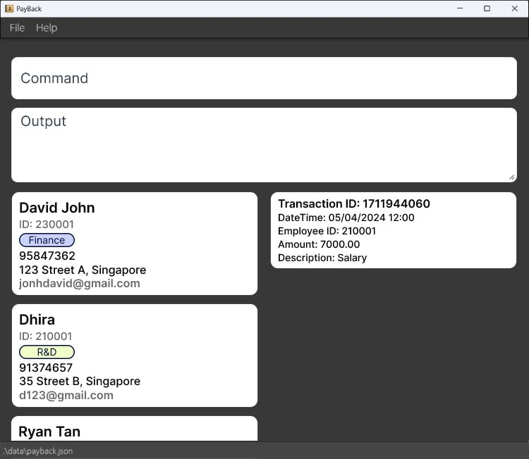
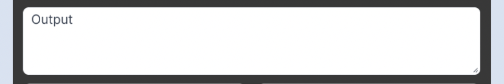
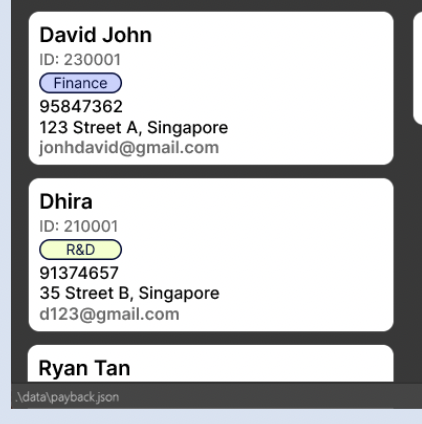
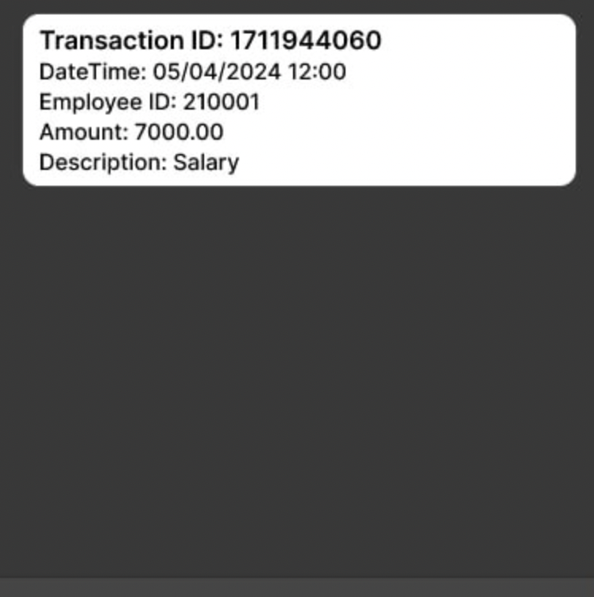
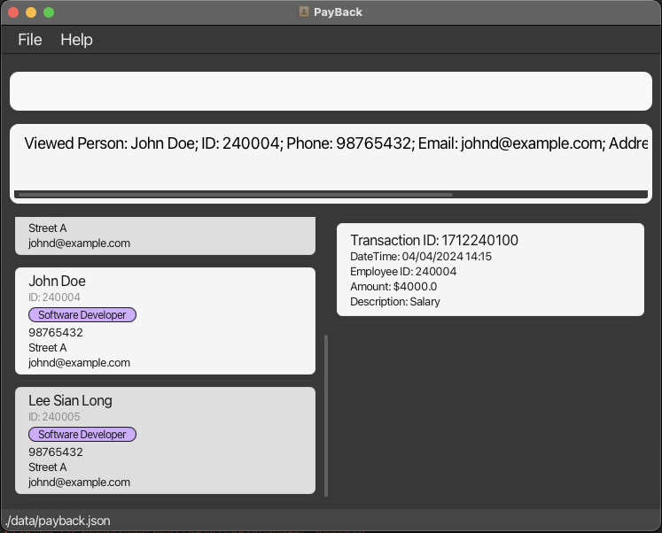
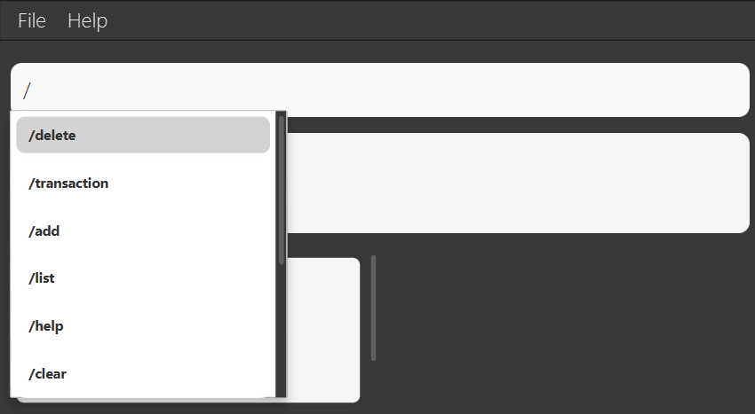

<a href="https://www.flaticon.com/free-icons/budget" title="budget icons">Budget icons created by Freepik - Flaticon</a>
<h1 style="font-size:25px;">Welcome Notes</h1>

Dear company managers,

Welcome to the user guide for **PayBack**! We're thrilled to have you on board and to introduce you to the comprehensive tool designed to streamline your employee information management process.

Throughout this user guide, you will find
- step-by-step instructions,
- helpful tips,
- best practices

to make the most out of our app. From onboarding new employees to tracking their work progress, and beyond, we have got you covered.

We recommend starting with:

- **Quick Start Guide**: This section provides a concise overview of the essential steps to launch PayBack.

- **Key Features**: This section offers a detailed explanation of each feature, including command formats and examples.

Thank you for choosing PayBack to optimise your company's management processes. We're committed to providing you with exceptional support along the way!

# Table of Contents
1. [Product Information](#product-info)
2. [Getting Started](#getting-started)
3. [Main Interface](#main-interface)
   1. [User Command Panel](#user-command-panel)
   2. [Command Result/Guidance](#command)
   3. [Employee List](#employee-list)
   4. [Transaction Panel](#transaction-panel)
   5. [Window Size](#window-size)
4. [Key Features](#key-features)
   1. [Add Employee](#add)
   2. [Delete Employee](#delete)
   3. [Edit Employee Information](#edit)
   4. [List All Employees](#list)
   5. [Find An Employee](#find)
   6. [Tag An Employee](#tag)
   7. [Add A Transaction](#transaction)
   8. [View Transaction Records of An Employee](#view)
   9. [AutoComplete TextBox](#autoComplete)
   10. [Clear All Employees](#clear)
   11. [Help](#help)
   12. [Save Data](#save-data)
   13. [Edit the Data File](#edit-data-file)
   14. [Exit the Program](#exit)
5. [Troubleshooting](#troubleshooting)
   1. [Java Version Compatibility](#java-version)
   2. [GUI Error](#gui-error)
   3. [Transferring data to another computer](#transfer-data)
6. [Command Summary](#command-summary)
7. [Support and Feedback](#support)
8. [Closing](#closing)

--------------------------------------------------------------------------------------------------------------------
## Product Information 

Payback is a software designed to take the hassle out of contact management so you can focus on what’s important in your organisation -  financial transactions. Offering both Graphical User Interface (GUI) and Command Line Interface (CLI), you can be sure that it will be easy for most to learn and use.

Our GUI has a visually intuitive environment, making it ideal for users who prefer point-and-click interactions and graphical representations of data. On the other hand, our CLI offers you the ability to perform tasks efficiently through text-based commands, allowing for rapid execution of commands.

Key features include:
1. Adding employees
2. Deleting employees
3. Editing employee information
4. Listing employees
5. Searching for employees
6. Tagging employees
7. Viewing transaction records of employees
8. Adding transactions to employees
9. Autocompleting text box
10. Clearing all employee information
11. Exiting the program

## Getting Started 

1. Ensure you have Java `11` or above installed in your Computer.

2. Download the latest `payback.jar` from [here](https://github.com/AY2324S2-CS2103T-T12-4/tp/releases).

3. Copy the file to the folder you want to use as the _home folder_ for your application.

4. Open a command terminal, `cd` into the folder you put the jar file in, and use the `java -jar payback.jar` command to run the application. 
   A GUI similar to the below should appear in a few seconds. Note how the app contains some sample data. 
   

5. Type the command in the command box and press Enter to execute it. e.g. typing **`/help`** and pressing Enter will open the help window. 
   Some example commands you can try:

   * `/list` : Lists all contacts.

   * `/add John Doe; 98765432; johndoe@example.com; street a; 2024` : Adds a contact named `John Doe` to the PayBack.

   * `/delete 240001` : Deletes the contact with id 240001.

6. Refer to the [Key Features](#key-features) below for details of each command.

--------------------------------------------------------------------------------------------------------------------
## Main Interface 
### User Command Panel: 

You can use this panel to interact with Payback by typing in your commands!

### Command Result/Guidance: 

Upon pressing Enter, you will be presented with the outcomes of your commands. In the event of any errors in the command format, you will receive guidance to help rectify the issue.

### Employee List 

All employee information is conveniently displayed here, allowing you to easily access and review all relevant details in a straightforward manner.

### Transaction Panel 

The transaction records corresponding to the employee with ID you provided are shown here.

### Window Size 
For optimal display quality, the application window size is configured with specific limitations to enhance user experience. The minimum and maximum dimensions of the window are predefined as follows:

* Minimum Width: PayBack window cannot be resized to a width smaller than 450 pixels.
* Maximum Width: The maximum width is capped at 700 pixels.
   
* Minimum Height: The window's height is set not to fall below 600 pixels.
* Maximum Height: The height of the window is limited to a maximum of 700 pixels.

## Key Features 
PayBack Application offers a range of features to a company manager to manage employees. Before we delve into the key features, let’s take a look at the command formats and the parameters.

| Parameters  | Details                              | Requirements                                                                                                          |
|-------------|--------------------------------------|-----------------------------------------------------------------------------------------------------------------------|
| ID          | Employee ID                          | Must be 6-digit number between 100001 and 999999 inclusive                                                            |
| NAME        | Full name of the employee            | Must only contain alphanumeric characters and spaces, and it should not be blank                                      |
| PHONE       | Employee's phone number              | Must only contain numbers and at least 3 digits long                                                                  |
| EMAIL       | Employee's email address             | Must include “@”                                                                                                      |
| ADDRESS     | Employee's residential address       | Must not be blank                                                                                                     |
| YEAR JOINED | Year the employee joined the company | Must be 4 digits                                                                                                      |
| TAG         | Add tags to categorise employees     | Must be alphanumeric                                                                                                  |
| AMOUNT      | Transaction's amount                 | Must be a positive number with at most 2 decimal places and should not exceed 9,999,999,999,999.99                    |
| DESCRIPTION | Transaction's description            | Must not be blank                                                                                                     |
| DATETIME    | Transaction's date and time          | Must be in the format of dd/MM/yyyy HH:mm and must be a valid date. The year should be greater than or equal to 2010. |

### Command formats:
- Words in UPPER_CASE are the parameters to be supplied by the user.
- Items in square brackets are optional.
- Items with …​ after them can be used multiple times.
- Parameters can be in any order, if PREFIX specified.
- Paraneters must be separated by a semicolon and space, if no PREFIX specified.

Here is a closer look at each key feature.

### Add Employee 
This feature allows the user to add new employees to the PayBack system and automatically generate an employee ID based on the year they joined and the last ID of that year.

There are two ways to use `/add` command:
- Use the `/add` command followed by the employee's details, separated by semicolons.
    - Format: `/add NAME; PHONE; EMAIL; ADDRESS; YEAR_JOINED; [TAG]…`
- Use the `/add` command followed by the employee’s details, preceded by PREFIX (_:name, :phone, :email, :address, :year, :tag_)
  - Format: `/add :name NAME :phone PHONE :email EMAIL :address ADDRESS :year YEAR_JOINED [:tag TAG]…`

Examples:

`/add :name John Doe :phone 91234567 :email johndoe@email.com :address 12 Kent Ridge Dr :year 2024 :tag Finance`

`/add John Doe; 91234567; johndoe@email.com; 12 Kent Ridge Dr; 2024; Finance`

### Delete Employee 
This feature deletes the specified employee from the PayBack system.

Format: `/delete ID`

**Note**:
- All transactions with `employeeId` = `ID` will be deleted as well.

Examples:

`/delete 240001`: deletes the employee with 240001 ID.

### Edit Employee Information 
This feature edits an existing employee in PayBack.

Format: 
`/edit ID [:name NAME] [:phone PHONE] [:email EMAIL] [:address ADDRESS] [:tag TAG_INDEX NEW_TAG]`

**Note**:
- At least one of the optional fields must be provided.
- Existing values will be updated to the input values.
- Only one tag can be edited at a time, valid tag index and new tag name must be provided.
- Duplicated tags are not allowed.
- Able to remove all the employee’s tags by typing `:tag -1`.

Example:

`/edit 240001 :phone 91234567 :email johndoe@example.com`:
Edits the phone number and email address of employee with ID 240001 to be 91234567 and johndoe@example.com respectively.

`/edit 240001 :tag -1`: Removes all tags of employee with ID 240001.

`/edit 240001 :tag 1 boss`: Changes the first tag of employee with ID 240001 to "boss".

### List All Employees 
This feature displays a list of entire employees currently stored in the PayBack system.

Use the `/list` command to refresh the displayed list and ensure the user is viewing the full information.

### Find An Employee 
This feature allows a user to search for specific employees.

Use the `/find` command followed by the appropriate prefix and keyword:
- `:name`, Search by employee name (supports multiple keywords).
   - The name must be fully typed to find; partial names will not yield a search result.
   - Multiple names can be searched.
- `:phone`, Search by phone number.
  - At least a 3-digit number is required.
- `:email`, Search by email address.
  - Finds keywords contained in the email, not the exact keywords.
- `:id`, Search by employee ID.
  - 6-digit numbers are required and must be between 100001 and 999999.
- `:year`, Search by year joined.
  - 4 digits of the number are required, and it must be between 2010 and 2099.
- `:tag`, Search by tag.

Example:

`/find :name Patrick Star`: 
Searches employees with the name ‘**Patrick Star**’
 **OR** 
Searches for employees named ’**Patrick**’ and ’**Star**’.

### Tag An Employee 
This feature allows a user to add “tags” to existing employees for easier identification.

Use the `/tag` command followed by the “employee's ID” and the desired tags, separated by the `:tag` prefix.

The application allows a user to add multiple tags to a single employee.  (e.g., “Intern”, “Developer”)

Example:

`/tag 240001 :tag Intern :tag Developer`:
Tags employee 240001 with ‘Intern’ and ‘Developer’

### Add A Transaction 

Adds a transaction to the specified person.

Format:
* `/transaction ID; AMOUNT; DESCRIPTION; [DATETIME]`
* `/transaction :id ID :amount AMOUNT :description DESCRIPTION [:datetime DATETIME]`

Examples:
* `/transaction 240001; 2000; Salary; 30/09/2021 12:00`
* `/transaction :id 240001 :amount 2000 :description Salary :datetime 30/09/2021 12:00`

### View Transaction Records of An Employee 

This feature displays the transaction records of an existing employee.

Format: `/view ID`

Transaction records will be displayed on the right side of the employee list panel, as shown above.

### AutoComplete TextBox 

Auto-complete feature allows to enter command quickly and accurately by suggesting possible completions as typing.

#### How it works:
As a command is typed into the command box, PayBack analyzes the input and suggests possible completions based on existing commands, taking the following inputs for the command.

- The autocomplete feature will suggest items that start with the text that is entered.
- Command words: PayBack will suggest matching command words as user type. For example, typing `/a` will suggest `/add`.
- The suggestions appear in a pop-up menu below the command box. Use the arrow keys to navigate the suggestions and press Enter or Tab to select the desired completion.

**Tips for Usage:**
1. Start typing the command: PayBack will begin suggesting completions after the first few characters are typed.
2. Use the arrow keys: Navigate through the suggestions using the up and down arrow keys.
3. Press Enter to select: Once the desired completion is seen, press Enter to select it.
4. Ignore suggestions: If the suggestions are not helpful, continue typing the command.

> **NOTE:** 
Wait for a few seconds before entering a command in the text field.

### Clear All Employees 

Format: `/clear`

Clear command to remove all employee data in PayBack.

> **NOTE:** 
Use the "Clear" command with **_CAUTION_**, as it will permanently delete all data in the system without confirmation.

### Help 

Format: `/help`

Shows a message explaining how to access the help page.

### Save Data 

PayBack data are saved in the hard disk automatically after any command that changes the data. There is no need to save manually.

### Edit the Data File 

PayBack data are saved automatically as a JSON file `[JAR file location]/data/payback.json`. Advanced users are welcome to update data directly by editing that data file.

:exclamation: **Caution:**
If modifications to the data file result in an invalid format, PayBack will discard all data and initiate the next run with an empty data file. 
Therefore, it is advisable to create a backup of the file before making any edits. 
Additionally, specific changes may lead to unexpected behavior in PayBack, such as if a value entered falls outside the acceptable range. Hence, proceed with editing the data file only if you are certain that you can make accurate updates.

### Exit the Program 

Format: `/exit`

Exit command provides a way for users to safely close PayBack.

--------------------------------------------------------------------------------------------------------------------

## Troubleshooting 

### 1. Java Version Compatibility 
Ensure you have Java 11 or above installed on your computer. PayBack requires Java 11 or later to function properly. You can download and install the latest version of Java from the official Java website (https://www.oracle.com/java).

### 2. GUI Error 
If you utilise multiple screens and relocate the application to a secondary screen, then subsequently revert to using only the primary screen, the graphical user interface (GUI) may open out of view. To resolve this issue, you can delete the preferences.json file generated by the application before launching it again.

### 3. Transferring data to another computer 
When installing PayBack on another computer, you can replace the empty data file it generates (e.g., payback.json) with the file containing the data from your previous PayBack home folder. This will ensure that your existing data is seamlessly transferred to the new installation.

--------------------------------------------------------------------------------------------------------------------
## Command Summary 

Action | Format, Examples
--------|------------------
**Add** | `/add NAME; PHONE; EMAIL; ADDRESS; YEAR_JOINED; [TAG]…`   e.g., `/add :name John Doe :phone 91234567 :email johndoe@email.com :address 12 Kent Ridge Dr :year 2024 :tag Finance`
**Delete** | `/delete ID`  e.g., `/delete 240001`
**Edit** | `/edit ID [:name NAME] [:phone PHONE] [:email EMAIL] [:address ADDRESS] [:tag TAG_INDEX NEW_TAG]`  e.g.,`/edit 240001 :phone 91234567 :email: johndoe@example.com`
**List** | `/list`
**Find** | `/find :name [name]` `/find :email [email]` `/find :phone [phone number]` `/find :id [ID]` `/find :year [year]` `/find :tag [tag]`   e.g., `find :name John`
**Tag** | `/tag`   e.g., `/tag 240001 :tag Intern :tag Developer`
**Help** | `/help`
**View** | `/view ID`   e.g., `/view 240001`
**Transaction** | `/transaction :id ID :amount AMOUNT :description DESCRIPTION [:datetime DATETIME]`   e.g., `/transaction :id 240001 :amount 2000 :description Salary :datetime 30/09/2021 12:00`
**Clear** | `/clear` 
**Exit** | `/exit`

## Support and Feedback 
Dear Company Managers,

If you encounter any difficulties, have questions, or require assistance while using PayBack, please do not hesitate to reach out to our dedicated support team. You can contact us through the following channels:

- Email: someone@nus.edu.sg
- Phone: +65 23142412

We genuinely appreciate your partnership and look forward to serving you better with your continued support and feedback!

## Closing 
As you conclude your journey of PayBack through this user guide, we want to express our gratitude for choosing us to streamline your company’s management processes. We hope the information provided will be valuable in helping you harness the full potential of PayBack.

Thank you once again for choosing PayBack. We look forward to serving you and your team, and we wish you continued success in all your endeavours!
